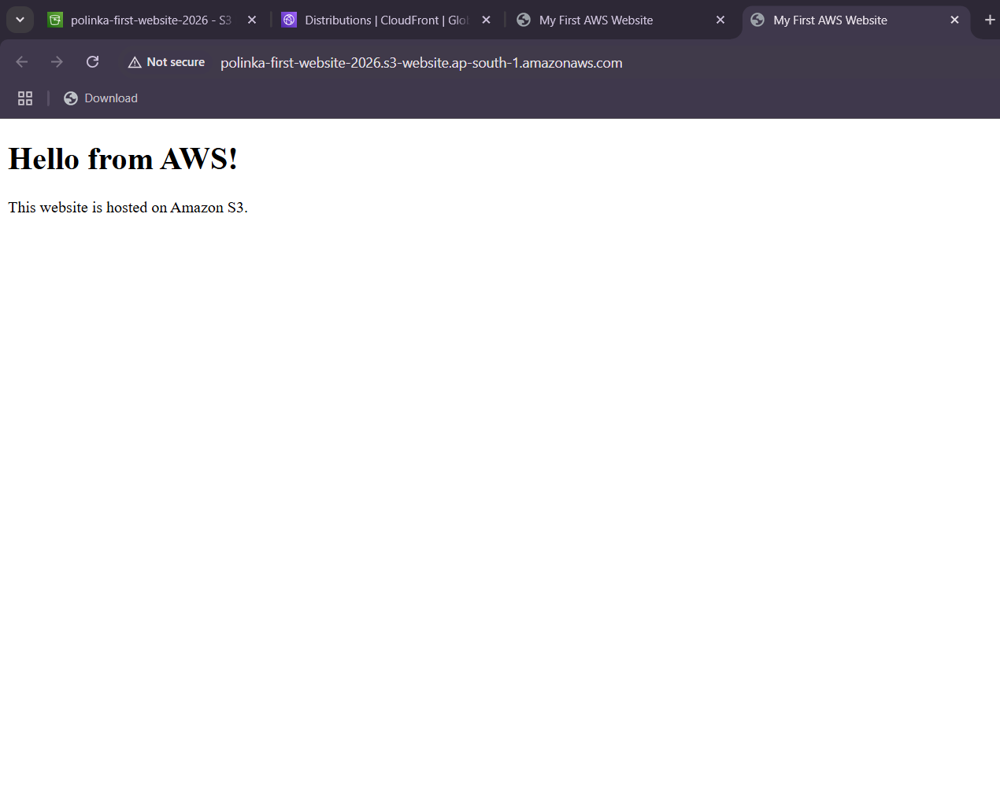
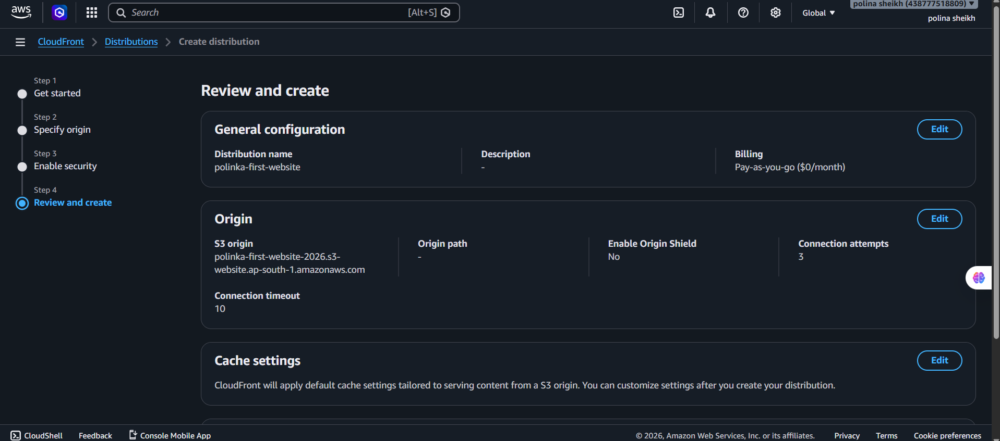
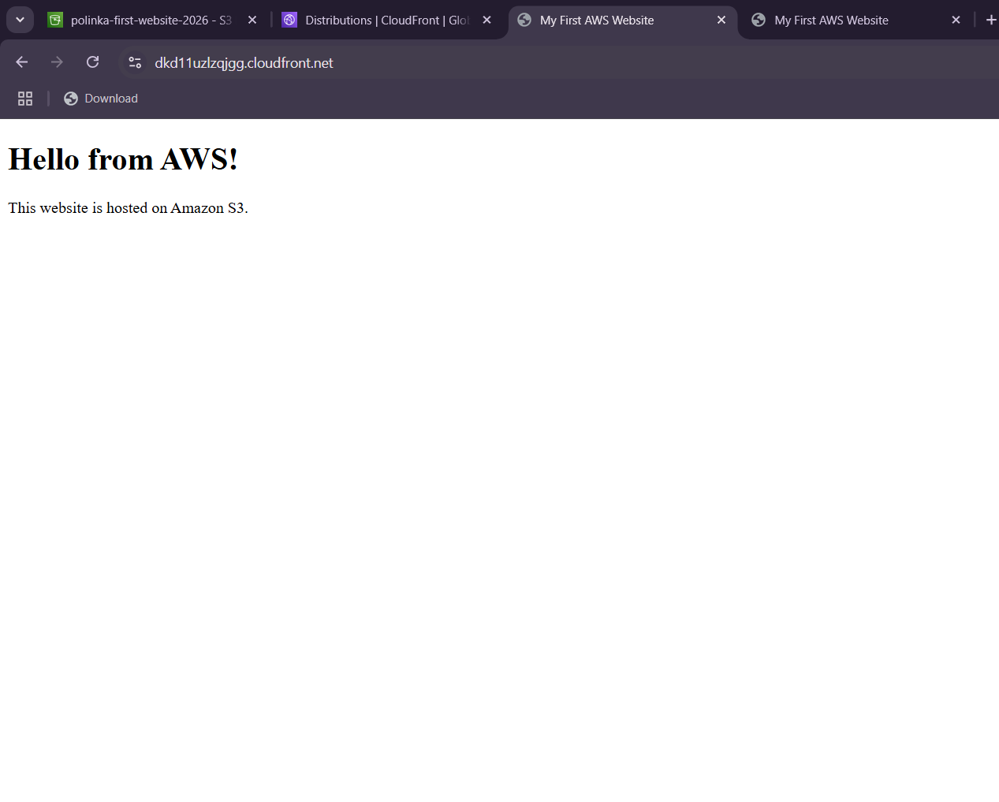

Project Journey

Why I Started This Project

As part of my cloud computing learning journey, I wanted to create and host my very first website using Amazon S3. My goal was simple: upload a basic HTML page and make it accessible on the internet. Since I am a beginner and currently in the first year of my Bachelor of Computer Applications (BCA), this project was my first hands-on experience with AWS services beyond theory.

Step 1: Hosting a Website with Amazon S3

I began by creating an Amazon S3 bucket and enabling Static Website Hosting. After uploading my HTML file, AWS generated a website endpoint that allowed visitors to access my website directly from the S3 bucket.

Website Hosted Through Amazon S3

This screenshot shows the website successfully hosted using the Amazon S3 Website Endpoint.

At this stage, my website was online and functioning correctly. However, I noticed that the website URL started with **HTTP** rather than **HTTPS**. Modern browsers displayed a **"Not Secure"** warning, which made me realize that simply hosting a website on S3 was not enough for a secure deployment.

Although the website worked perfectly, visitors had to manually proceed past browser warnings because the connection was not encrypted. This motivated me to learn how websites are secured in real-world cloud environments.

Step 2: Discovering the Need for CloudFront

While investigating the issue, I learned that Amazon S3 Static Website Endpoints only support HTTP and do not directly provide HTTPS support.

This led me to discover Amazon CloudFront, AWS's Content Delivery Network (CDN). CloudFront provides:

- HTTPS support using SSL/TLS encryption
- Faster content delivery through global edge locations
- Reduced latency for users worldwide
- Improved performance and reliability
- A more professional cloud architecture

Instead of stopping at basic website hosting, I decided to learn CloudFront and integrate it into my project.

Step 3: Configuring CloudFront

I created a CloudFront distribution and configured my S3 website endpoint as the origin. This allowed CloudFront to retrieve content from my S3 bucket and deliver it securely to users.

CloudFront Distribution Configuration

The screenshot below shows the CloudFront distribution setup process.

Through this step, I learned how AWS services can work together to solve practical problems. I also gained experience configuring a CDN for the first time.

Step 4: Accessing the Website Through CloudFront

After the distribution finished deploying, CloudFront generated a unique domain name that could be used to access the website.

Website Delivered Through CloudFront

The screenshot below shows the final website being delivered through CloudFront.

The website was now accessible through HTTPS, making it more secure and aligned with modern web standards.

What I Learned

This project taught me much more than simply uploading files to a storage bucket.

Through experimentation and troubleshooting, I learned:

- How Amazon S3 Static Website Hosting works
- How to upload and serve website files from S3
- How bucket permissions affect website accessibility
- The difference between HTTP and HTTPS
- Why secure communication matters
- What a Content Delivery Network (CDN) does
- How Amazon CloudFront integrates with Amazon S3
- How multiple AWS services can be combined into a complete solution

---

Conclusion

What started as a simple goal of hosting a basic HTML page evolved into a valuable learning experience about cloud infrastructure and secure content delivery.

Initially, I only intended to learn Amazon S3. However, encountering browser security warnings encouraged me to investigate further, which led me to Amazon CloudFront and the importance of HTTPS. By solving this challenge, I not only completed my first AWS project but also gained practical knowledge about how real-world cloud architectures are designed.

This project marks the beginning of my AWS Cloud Computing journey. It has given me confidence to continue exploring AWS services such as IAM, EC2, Route 53, Lambda, and DynamoDB while building more advanced cloud projects in the future.
